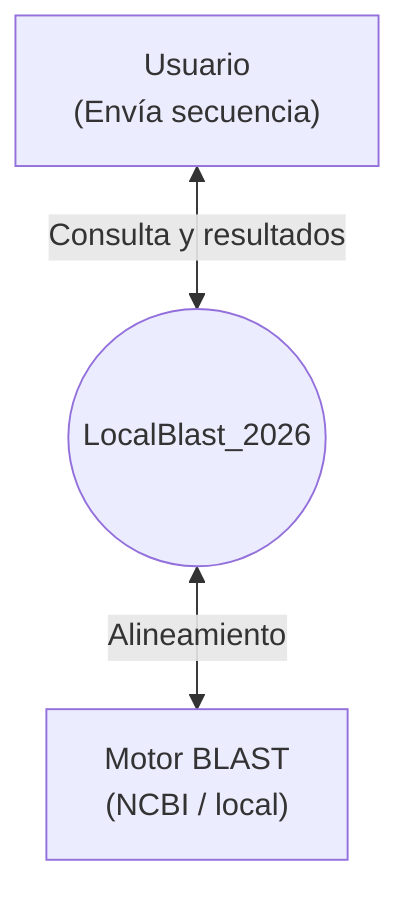

El diagrama de nivel cero o diagrama de contexto inicial de este proyecto corresponde a: 

Donde un usuario es un actor que envia una secuencia a la aplicacion principal y seguido
de una validacion de dicha secuencia se lleva a cabo una consulta o query a una API. Es asi que a partir
de un alineamiento local con otras secuencias en la BD del NCBI, el usuario
obtiene el resultado de su consulta.
