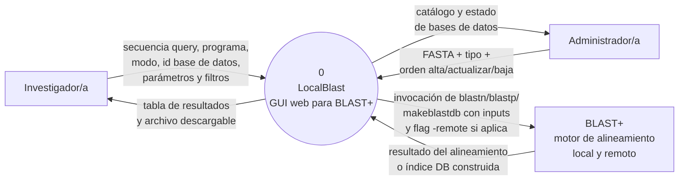
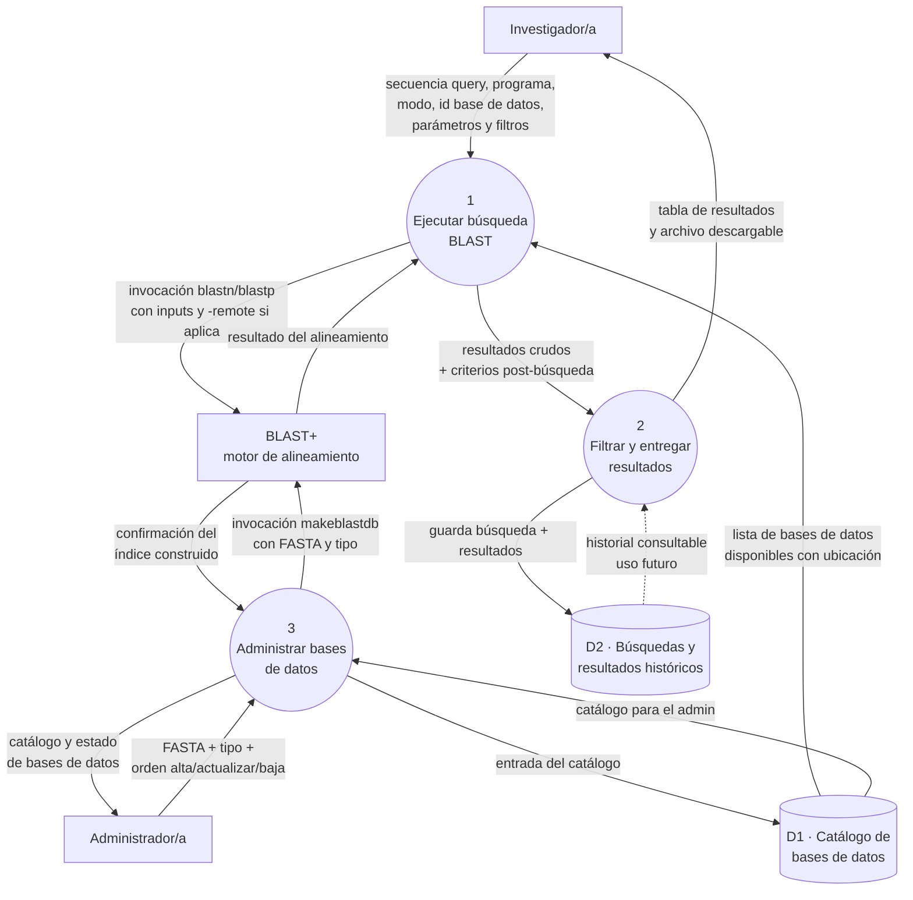

---

## Nivel 0 · Diagrama de contexto

El sistema completo se representa como un único proceso (0), con sus tres entidades externas: los dos actores humanos (Investigador/a y Administrador/a) y el único sistema externo con el que dialoga (**BLAST+**, el motor de alineamiento sobre el que se apoya).

**Aclaración sobre el modo local vs remoto.** Ambos modos son, desde el punto de vista de nuestra GUI, **una invocación al motor BLAST+**; la diferencia está enteramente del lado de BLAST+:

- En **modo local**, BLAST+ lee los índices de las bases de datos que residen en el mismo servidor.
- En **modo remoto**, BLAST+ recibe la flag `-remote` y él mismo se comunica con los servidores públicos de NCBI para resolver la búsqueda. Nuestro sistema no participa de ese diálogo.

Por eso desde el DFD ambos casos comparten los mismos dos flujos externos hacia BLAST+ (invocación y resultado). El comportamiento distinto de BLAST+ según la flag no cambia el diagrama de contexto de nuestro sistema.

## Nivel 1 · Descomposición del proceso 0

El proceso 0 se descompone en **tres procesos internos**, más dos almacenes. La regla de balanceo se respeta: los seis flujos externos que cruzan el límite del sistema son los mismos que en Nivel 0, redistribuidos entre los procesos internos.

**Chequeo de balanceo:** los seis flujos externos aparecen en Nivel 1 con los mismos extremos externos que en Nivel 0. Los que van hacia BLAST+ se dividen entre P1 (para búsqueda) y P3 (para construir índices), pero desde afuera del sistema siguen siendo los dos mismos flujos.

---

Procesos y entidades:

Del proceso general del sistema P0, se descomponen 3 procesos principales: P1, P2 y P3:
- P1: Gestionar entrada y validar secuencia
Recibe la secuencia cruda y los parámetros del usuario. Verifica el formato (FASTA/RAW), detecta si es ADN o proteína, y confirma que el algoritmo BLAST elegido sea compatible. Entrega la secuencia normalizada y los parámetros listos para ejecutar.
- P2: Ejecutar búsqueda y aplicar filtros avanzados
Es el núcleo operativo. Obtiene los alineamientos en bruto, ya sea consultando la API remota de NCBI o ejecutando BLAST+ contra las bases de datos locales (D1). Inmediatamente después, aplica los filtros combinados (taxonomía, longitud mínima de alineamiento y presencia de gaps) consultando los archivos de linaje en D1. Solo entrega resultados ya depurados.
- P3: Gestionar reportes y recursos locales
Centraliza toda la salida hacia el exterior: genera las gráficas visuales, prepara los reportes descargables (CSV, JSON, PDF y FASTA compilado) para el usuario. Además, mantiene la infraestructura local: guarda resultados en caché (D1) y se encarga de descargar/actualizar los índices BLAST+ desde el FTP cuando es necesario.

- Usuario / Investigador: Persona que envía la consulta y recibe los resultados enriquecidos (gráficos y reportes).

- Servidor NCBI API:  Fuente remota de datos. Recibe peticiones QBlast (Flujo 3) y devuelve resultados en XML/JSON sin filtrar (Flujo 4).

- Repositorio Público FTP:  Fuente externa de índices. Provee los archivos de bases de datos BLAST+ (y taxonomía) para que el sistema pueda funcionar en modo local.

Almacén:
 
- D1:  Bases de Datos Locales + Caché de Resultados: Guarda los índices BLAST (.nhr, .nin, etc.), los archivos de taxonomía (names.dmp/nodes.dmp) y los resultados de búsquedas históricas para reutilización rápida.

Flujos de datos:

- Flujo 1: secuencia + parámetros + modo de ejecución.

- Flujo 2: alineamientos ya filtrados + gráficas + reportes.

- Flujo 3: petición a NCBI con filtros estándar.

- Flujo 4: resultados crudos desde NCBI (sin filtros avanzados).

- Flujo 5: ejecución de BLAST local contra índices.

- Flujo 7: guardado de resultados en caché.

- Flujo 8a: solicitud de descarga/actualización de índices.

- Flujo 8b: entrega de los índices descargados desde el FTP.
