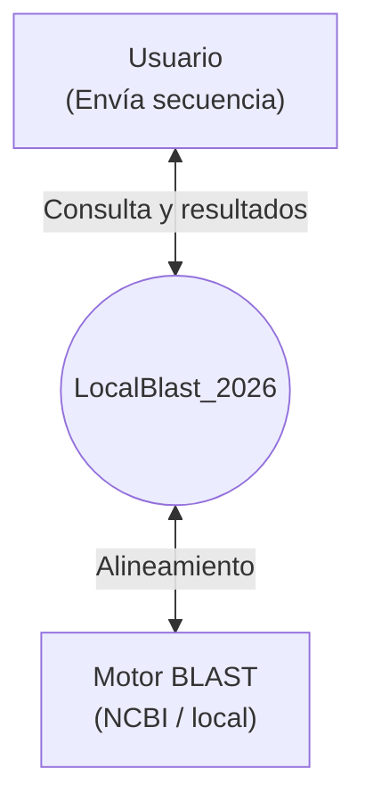

El diagrama de nivel cero de este proyecto corresponde a:



Donde un usuario es un actor que envia una secuencia a la aplicacion principal y seguido
de una validacion de dicha secuencia se lleva a cabo una consulta o query a una API. Es asi que a partir
de un alineamiento local con otras secuencias en la BD del NCBI, el usuario
obtiene el resultado de su consulta.

El diagrama de nivel 1 corresponde a:

```mermaid
graph TD
    A["Entidad: Usuario / Investigador"]
    B(("Proceso: Sistema BLAST Híbrido<br/>GUI - Motor de Filtros Exclusivos"))
    C["Entidad: Servidor NCBI API"]
    D[("Almacén: Bases de Datos Locales + Caché de Resultados")]
    E["Entidad: Administrador Técnico"]

    A -->|Flujo 1: Envía secuencia FASTA/RAW, parámetros y selección de modo| B
    B -->|Flujo 2: Devuelve alineamientos enriquecidos, gráficas y reportes descargables| A
    B -->|Flujo 3: Petición QBlast vía REST/SOAP con filtros estándar| C
    C -->|Flujo 4: Resultados en XML/JSON crudos, sin filtros avanzados| B
    B -->|Flujo 5: Ejecuta blastn/blastp/blastx contra índices locales| D
    D -->|Flujo 6: Retorna hits en formato ASN.1/tabular| B
    B -->|Flujo 7: Guarda en caché resultados históricos para reutilización rápida| D
    E -->|Flujo 8: Descarga/actualiza índices BLAST+ desde repositorios públicos FTP| D
