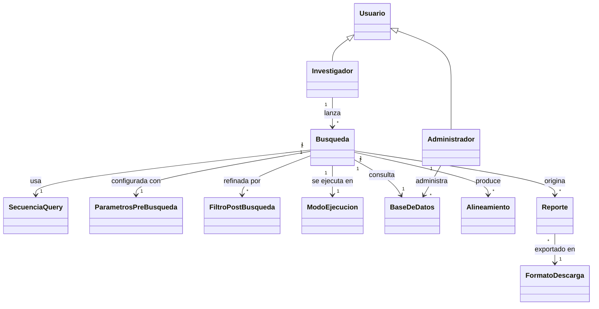

# Modelo de Dominio Conceptual — LocalBlast

Este modelo describe las **entidades esenciales del problema** y sus relaciones, en el nivel del TP1: sin atributos, sin tipos de dato, sin métodos ni visibilidad. El nivel de detalle interno de cada clase llega recién en el TP4 (diseño detallado).

Es un modelo del dominio del problema, no de la implementación: expresa "qué cosas existen y cómo se relacionan en el mundo del usuario", no cómo se van a codificar.

