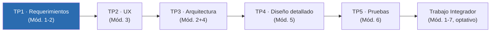
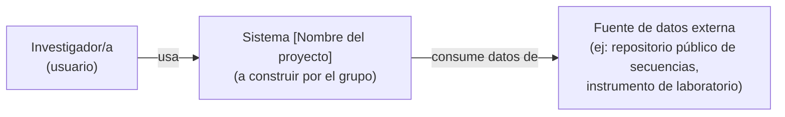

# Guía de Trabajo Práctico N.° 1 — Requerimientos del Sistema

| | |
|---|---|
| **Materia** | Ingeniería de Software — Licenciatura en Bioinformática (FIUNER) |
| **Módulos** | 1 (El software como producto y procesos) y 2 (Requerimientos y atributos de calidad) |
| **Semanas de trabajo** | 2 (10/08), 4 (24/08) y 5 (31/08) |
| **Presentación (Instancia 1)** | martes 01/09 |
| **Modalidad** | grupal |
| **Plataforma única** | GitHub (código, documentación y control de versiones) |

> Este TP es el punto de partida de un proyecto que el grupo va a construir de forma incremental durante todo el cuatrimestre. Lo que se decide y documenta acá — el dominio, los stakeholders, el alcance — es la base sobre la que se apoyan la arquitectura (TP3), el diseño (TP4) y las pruebas (TP5). Documentar bien ahora ahorra trabajo (y discusiones) después.

---

## 1. Objetivos de aprendizaje

Al finalizar este TP, cada integrante del grupo debería poder:

- Comprender el software como producto de ingeniería —"la aplicación de un enfoque sistemático, disciplinado y cuantificable para el desarrollo, operación y mantenimiento del software" (definición IEEE, Módulo 1)— y distinguirlo de la programación como actividad individual.
- Identificar las causas recurrentes de fracaso en proyectos de software (Módulo 1: problemas de duración, costo, compromisos y manejo de desvíos) y anticipar cuál de ellas es más probable en el proyecto propio.
- Aplicar al menos una técnica de elicitación de requerimientos sobre un dominio bioinformático real.
- Distinguir requerimientos funcionales de atributos de calidad (no funcionales) y expresarlos con precisión.
- Redactar casos de uso y/o historias de usuario con criterios de aceptación verificables.
- Construir un modelo de dominio inicial: las entidades y relaciones esenciales del problema.
- Dejar el repositorio Git del grupo configurado y con evidencia real de proceso desde el primer commit.

---

## 2. Modalidad de trabajo

- Grupos de **2 a 4 estudiantes** (verificar con el docente el número exacto vigente para esta cohorte, ya que la planificación indica valores distintos en dos secciones — 2–3 en la metodología didáctica general, 3–4 en la metodología de formación práctica).
- Cada grupo trabaja sobre un **único caso de estudio** durante todo el cuatrimestre. Dos modalidades posibles (el docente indica al inicio cuál aplica este cuatrimestre):
  - **Caso de estudio propuesto por la cátedra**, con una especificación de base compartida por todos los grupos.
  - **Caso de estudio propuesto por el grupo**, con aprobación docente antes de iniciar TP1.
- El TP1 es también donde se decide y valida el caso de estudio, si la modalidad es de propuesta libre. Por eso empieza con una actividad de descubrimiento.

---

## 3. Marco general: un ciclo de vida que se recorre en el cuatrimestre

El proyecto no se construye de una sola vez ni de punta a punta antes de mostrar nada: se construye de forma **iterativa e incremental**, un TP a la vez, y cada instancia de presentación es un punto de control (una revisión, no un examen sobre teoría suelta). El TP1 fija la primera iteración.



Como parte del Módulo 1, cada grupo debe poder argumentar **qué modelo de ciclo de vida** (iterativo, incremental, ágil, etc.) mejor describe cómo van a trabajar, y por qué — no como ejercicio teórico aislado, sino como justificación de cómo van a organizar las próximas 16 semanas.

Esto conecta directamente con el principio de **anticipación del cambio**, uno de los principios fundamentales de la Ingeniería de Software (Módulo 1): el software cambia por naturaleza —por la evolución del dominio, por requerimientos que se ajustan, por decisiones que se revisan— y ese cambio se gestiona con las herramientas adecuadas para almacenar y recuperar versiones de manera controlada. Esa es, en definitiva, la razón de fondo por la que el repositorio Git se abre desde el primer día del TP1 y no recién en el Módulo 7.

---

## 4. Actividad de descubrimiento (inicio de Semana 2)

Antes de escribir una sola historia de usuario, el grupo necesita tener claro **qué va a construir y para quién**. Esta actividad se hace en grupo, en la primera sesión de práctica del TP1, y no requiere código ni herramientas todavía — solo papel, pizarra o un documento compartido temporal.

### 4.1 Si el caso de estudio es de propuesta libre

Cada grupo completa el siguiente **canvas de descubrimiento** discutiendo en voz alta cada punto (no alcanza con completarlo individualmente y sumar respuestas):

| Bloque | Preguntas guía |
|---|---|
| **Dominio y problema** | ¿Qué problema real del ámbito bioinformático van a atacar? ¿Quién lo sufre hoy y cómo lo resuelve actualmente (planillas, scripts sueltos, herramientas dispersas)? |
| **Datos** | ¿Qué tipo de datos biológicos maneja el sistema (secuencias, estructuras, expresión génica, imágenes, metadatos clínicos)? ¿De dónde vienen? ¿Qué formato tienen (FASTA, VCF, CSV, etc.)? |
| **Usuarios y stakeholders** | ¿Quién va a usar el sistema? ¿Hay más de un perfil (investigador, técnico de laboratorio, administrador)? ¿Quién más tiene interés en el proyecto aunque no lo use directamente (director de un laboratorio, un comité de ética)? |
| **Valor** | Si el sistema funciona, ¿qué cambia para el usuario? ¿Qué decisión o tarea se vuelve más rápida, más confiable o directamente posible? |
| **Alcance realista** | ¿Qué es lo mínimo que, construido en un cuatrimestre por 2 a 4 personas, ya demuestra el valor central? ¿Qué queda deliberadamente afuera? |
| **Riesgos de fracaso** (Módulo 1, "problemas en requerimientos de software") | De los problemas típicos que ven en teoría —*¿qué es lo que se necesita?* (visión poco clara de los stakeholders), *incertidumbre al inicio*, *cambio de requerimientos*, *negociación de requerimientos* entre stakeholders con intereses distintos—, ¿cuál es el más probable en este proyecto puntual, y qué van a hacer para mitigarlo? |
| **Datos sensibles** (conecta con Módulo 1, ética profesional) | Si el sistema maneja datos biológicos o clínicos identificables (metadatos de pacientes, muestras asociadas a personas), ¿qué implica eso en términos de confidencialidad y privacidad? El Código de Ética IEEE/ACM exige proteger la privacidad de los usuarios como parte del interés público — vale la pena dejarlo escrito desde ahora, aunque el sistema no se implemente todavía. |

El resultado de este canvas **no se entrega como documento aparte**: se vuelca directamente en el README inicial del repositorio (sección 6) y alimenta el modelo de dominio y las primeras historias de usuario.

### 4.2 Si el caso de estudio es provisto por la cátedra

El canvas se completa igual, pero las primeras dos filas (**Dominio y problema**, **Datos**) se responden explorando la especificación de base entregada por la cátedra, no inventando un problema nuevo. El foco del descubrimiento pasa a estar en interpretar correctamente el dominio dado, identificar ambigüedades en la especificación compartida, y decidir con criterio propio los límites de alcance dentro de lo permitido.

### 4.3 Salida de la actividad: diagrama de contexto inicial

Como cierre de la actividad de descubrimiento, el grupo produce un **diagrama de contexto** que ubica al sistema en su entorno: quién interactúa con él y con qué otros sistemas se conecta, si los hay.

> **Sobre la notación:** en el TP1 este diagrama es deliberadamente **informal** — cajas y flechas simples, sin las convenciones de niveles, tipos de elemento y relaciones del modelo C4. El modelo C4 es contenido del Módulo 4 y se formaliza recién en el TP3 (la bibliografía de la cátedra lo marca como lectura obligatoria antes de esa instancia). Pedirlo con esa notación ahora sería adelantar una herramienta que el grupo todavía no vio en teoría — acá alcanza con que quede claro, en cualquier forma legible, quién usa el sistema y con qué otros sistemas o fuentes de datos se conecta.



Este diagrama se escribe directamente como bloque Mermaid en un archivo `.md` del repositorio — ver sección 6. Si el grupo no vio aún las convenciones de Mermaid/Markdown de la cátedra, es el momento de revisarlas: [`docs/instructivos/git-github-y-documentacion.md`](../instructivos/git-github-y-documentacion.md).

---

## 5. Trabajo semana a semana

| Semana | Fecha | Foco | Artefactos que avanzan |
|---|---|---|---|
| 2 | 10/08 | **Inicio** — actividad de descubrimiento, identificación de stakeholders, exploración del dominio | Canvas volcado en README, lista de stakeholders, diagrama de contexto inicial |
| 3 | 17/08 | **Feriado nacional (Paso a la Inmortalidad del Gral. San Martín) — sin sesión de práctica.** El grupo puede seguir commiteando avances por su cuenta, pero no hay actividad de cátedra pautada esta semana. | — |
| 4 | 24/08 | **Trabajo** — modelo de dominio refinado, casos de uso detallados, historias de usuario con criterios de aceptación | Modelo de dominio (Mermaid ER o de clases conceptual), CU/HU |
| 5 | 31/08 | **Cierre** — especificación detallada de un caso de uso/HU representativo, preparación de la presentación | SRS consolidado, atributos de calidad según ISO 25010 (con al menos un escenario de calidad completo), primera línea base del repositorio (tag `v1.0.0`) |
| — | 01/09 | **Instancia 1** — presentación oral (Módulos 1+2) | Defensa de decisiones ante el docente |

No hace falta esperar a la Semana 5 para escribir el SRS: se construye de forma incremental, con commits frecuentes desde la Semana 2 (ver sección 6). Los atributos de calidad recién se trabajan en la práctica a partir de la Semana 5, porque la teoría de ISO 25010 se dicta el martes 25/08 (Semana 4) — antes de eso, el grupo cuenta como máximo con el video de aula invertida como primer contacto con el tema, no con la sesión de profundización.

---

## 6. Arranque de la Administración de la Configuración (Git/GitHub)

Desde este primer TP, el repositorio **es** parte del proyecto, no un lugar donde se sube el resultado al final. Todo el grupo trabaja sobre la misma rama (`main`) durante el TP1 — todavía no se introduce branching, eso llega en el TP2.

### 6.1 Crear el repositorio (Semana 2, primeros 20-30 minutos)

- [ ] Crear un repositorio en GitHub, uno por grupo (nombre sugerido: `bio-[nombre-tentativo-del-sistema]-2026`).
- [ ] Agregar a todos los integrantes del grupo como colaboradores.
- [ ] Crear la estructura inicial de carpetas:

```
bio-[nombre-sistema]-2026/
├── docs/
│   ├── requirements/      ← SRS, historias de usuario, casos de uso
│   ├── architecture/      ← se completa desde el TP3
│   └── ux/                ← se completa desde el TP2
├── src/                   ← se completa desde el TP4
├── tests/                 ← se completa desde el TP5
└── README.md
```

- [ ] Escribir el `README.md` inicial con: nombre del proyecto, integrantes, y una síntesis breve del canvas de descubrimiento (problema, usuarios, alcance).
- [ ] Agregar un `.gitignore` apropiado para Python (o R, según el stack que anticipen usar).
- [ ] Primer commit: `chore: estructura inicial del repositorio`.

### 6.2 Commits durante el TP1

Cada historia de usuario o caso de uso que se agrega al SRS se commitea con su propio identificador desde el principio — esto es lo que después, en el Módulo 7, se formaliza como trazabilidad. Convención sugerida:

```
docs: agrega HU-01 al SRS — carga de archivo FASTA
docs: agrega HU-02 al SRS — análisis de calidad de secuencias
docs: agrega modelo de dominio inicial v0.1
docs: agrega lista de stakeholders y roles identificados
docs(requerimientos): agrega atributos de calidad — rendimiento y usabilidad
```

Commits pequeños y frecuentes (al final de cada sesión de trabajo, como mínimo) valen más como evidencia de proceso que un único commit gigante la noche anterior a la presentación — y la planificación de la materia lo dice explícitamente: la historia de commits es parte de la evidencia evaluable.

### 6.3 Cierre del TP1: primera línea base

El día antes de la presentación, una vez que todo esté commiteado:

```bash
git tag -a v1.0.0 -m "Línea base TP1: requerimientos aprobados para presentación 01/09"
git push origin v1.0.0
```

Esta etiqueta marca formalmente la primera línea base del proyecto — el punto de referencia contra el que se comparan los cambios futuros.

> **Documentación y diagramas:** todo el SRS se escribe en Markdown y todos los diagramas (contexto, modelo de dominio) en Mermaid, dentro de los `.md` del repositorio — no como capturas de pantalla ni documentos externos. La estructura de carpetas detallada, los ejemplos de Mermaid por etapa y el checklist de Pages están en [`docs/instructivos/git-github-y-documentacion.md`](../instructivos/git-github-y-documentacion.md).

---

## 7. Artefactos a entregar

- [ ] `README.md` con síntesis del descubrimiento (problema, usuarios, alcance, modelo de ciclo de vida elegido y por qué).
- [ ] Lista de stakeholders y usuarios, con roles.
- [ ] Diagrama de contexto inicial (Mermaid, `docs/architecture/contexto-inicial.md` o similar).
- [ ] Modelo de dominio inicial (Mermaid — diagrama ER o de clases conceptual).
- [ ] Casos de uso y/o historias de usuario con criterios de aceptación verificables (formato *Como… quiero… para…*, criterios en estilo Given-When-Then si el grupo ya lo maneja).
- [ ] Atributos de calidad identificados según ISO 25010, con al menos un escenario de calidad completo (fuente–estímulo–artefacto–entorno–respuesta–medida).
- [ ] SRS consolidado en `docs/requirements/`.
- [ ] Bitácora de uso de IA (`docs/uso-ia.md`) — ver sección 8.
- [ ] Repositorio con historial de commits real y tag `v1.0.0`.

## 8. Tarea de uso crítico de IA

Como en todos los TP de la materia, hay una tarea explícita de uso y análisis de herramientas de IA generativa. Para el TP1, por ejemplo: usar un asistente de IA para ayudar a redactar historias de usuario o criterios de aceptación a partir del canvas de descubrimiento. Documentar en `docs/uso-ia.md`:

- Qué herramienta se usó y para qué tarea puntual.
- Qué generó la IA (sin pegar el contenido completo si es extenso — alcanza con una síntesis o un fragmento representativo).
- Qué se modificó, aceptó o descartó del resultado, y **por qué**.
- Qué error o imprecisión detectó el grupo, si hubo alguno.

Esta reflexión es parte de lo que se evalúa en la Instancia 1, no un anexo opcional.

---

## 9. Instancia 1 — qué se defiende (01/09)

La presentación es oral y grupal. El docente evalúa, según la rúbrica de la materia:

1. **Calidad técnica** del SRS y los artefactos (corrección, completitud, precisión).
2. **Comprensión real del dominio** bioinformático elegido (no aplicación mecánica de una plantilla genérica).
3. **Argumentación oral**: por qué estas historias de usuario, por qué estos atributos de calidad, qué alternativas se descartaron y por qué.
4. **Reflexión sobre el uso de IA**: honesta, específica, con pensamiento crítico.
5. **El repositorio Git como evidencia del proceso**: historial de commits, no solo el resultado final.

Preguntas que conviene poder responder sin dudar: *¿por qué eligieron este alcance y no uno más amplio o más acotado? ¿Qué stakeholder quedó fuera de la primera versión y por qué? ¿Qué requerimiento fue el más difícil de acotar y cómo lo resolvieron?*

---

## 10. Checklist final antes de presentar

- [ ] Todos los `.md` están commiteados en el repositorio del grupo (no en Google Docs, Word ni Notion).
- [ ] Los diagramas están en bloques ```` ```mermaid ```` dentro de archivos `.md`, no como imágenes pegadas.
- [ ] El SRS cubre requerimientos funcionales y atributos de calidad, con al menos un escenario de calidad completo.
- [ ] Cada historia de usuario/caso de uso tiene criterios de aceptación verificables.
- [ ] `docs/uso-ia.md` está actualizado.
- [ ] El tag `v1.0.0` está creado y publicado (`git push origin v1.0.0`).
- [ ] Todos los integrantes pueden explicar y defender cualquier decisión del documento, no solo la parte que escribieron.

---

## Referencias rápidas

**Material de cátedra (Módulo 1, lectura obligatoria antes de la Semana 2):** Introducción a la Ingeniería de Software · La Crisis del Software · Fracasos por el Software · Consecuencias de la Mala Calidad · La Ingeniería de Software · Principios de la Ingeniería de Software · SWEBOK · Ética Profesional · La Problemática. Estos nueve documentos son la base directa de la sección 1 (objetivos), la sección 3 (marco de ciclo de vida) y las filas de "riesgos de fracaso" y "datos sensibles" del canvas de descubrimiento (sección 4).

**Bibliografía complementaria (Módulo 2, requerimientos):**

- Sommerville, I. *Ingeniería del Software* (10.ª ed.), capítulos 4 y 5 — ingeniería de requerimientos.
- Wiegers, K. y Beatty, J. *Software Requirements* (3.ª ed., 2013) — el más práctico para redactar requerimientos concretos.
- Cockburn, A. *Writing Effective Use Cases* (2000), capítulos 1–3.
- ISO/IEC 25010 — modelo de calidad del producto: [iso25000.com](https://iso25000.com/index.php/normas-iso-25000/iso-25010).
- Criterio **INVEST** para evaluar historias de usuario (Independiente, Negociable, Valiosa, Estimable, Small, Testeable).
- Criterios de aceptación en formato **Given-When-Then** (estilo BDD) — se conecta directamente con el Módulo 6 (Pruebas) más adelante en el cuatrimestre.

---

*Guía de Trabajo Práctico N.° 1 — Ingeniería de Software, Licenciatura en Bioinformática, FIUNER.*
